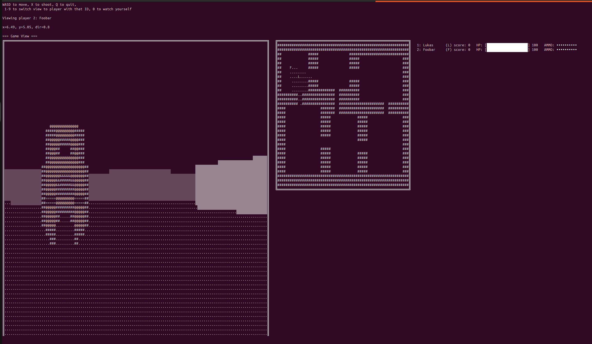

# DOOMQL

A multiplayer DOOM-like shooter implemented entirely in SQL, powered by CedarDB.




You read that right, *everything* is written in SQL: The renderer, the game loop, and the multiplayer sync.

This project started as a thought experiment. Could we take [DuckDB DOOM](https://github.com/patricktrainer/duckdb-doom) and crank it up to 11? Bigger viewport, more FPS, sprites, multiplayer support, while doing *everything* in SQL? Turns out, we can.

## Blog
Read more details about DOOMQL in [this blog post](https://cedardb.com/blog/doomql).

## Features
* **Pure SQL renderer:** Raycasting, sprite projection, occlusion, and HUD, all implemented as `VIEWS`.
* **Multiplayer:** CedarDB handles concurrent players, synchronization, and state.
* **Hackable game state:** Change config, teleport players, or balance weapons with a single `UPDATE`.
* **First-class cheating support:** Since everyone just talks SQL to the DB, half the fun is figuring out sneaky cheating queries.
* **Minimal client:** 150 lines of Python to capture key presses and display frames to your terminal.


## How it works
* **Tables:** Everything is data: Maps, mobs, players, inputs, sprites
* **Views:** Layers of SQL transform state into a 3D view (scene, HUD, minimap)
* **Game loop:** A tiny shell script runs SQL at 30 Hz to advance bullets, check collisions, handle input, respawn players.
* **Client:** Queries the `screen` view, polls your keyboard, and pushes inputs to the DB.


## Getting started

### Prerequsistes
* Docker
* Python 3 with `psycopg2` installed
* A wide terminal window (seriously, zoom out, or you will have issues with line breaks)

### Run

```sh
docker pull cedardb/cedardb:latest
docker run --rm -p 5432:5432 -e CEDAR_PASSWORD=postgres --detach  cedardb/cedardb:latest
# Wait a few seconds for Cedardb to start
./server.sh

# in a second terminal window, zoom way out to have no line wraping issues
python3 pyclient.py
```
The client will connect as a new player, or reconnect you if you enter the same username you used previously.

## Controls

* `W`, `A`, `S`, `D` movement
* Press `X` to shoot

## The cheating metagame
Since everyone is a DB superuser, cheating is half the fun:

```sql
-- Infinite HP
UPDATE players SET hp = 100000 WHERE id = <your_id>;

-- Delete other players' inputs
UPDATE inputs SET action = NULL WHERE player_id != <your_id>;

-- Claim all bullets as yours
UPDATE mobs SET owner = <your_id> WHERE kind = 'bullet';
```

## Contributing
Pull Requests welcome! 
There is *a lot* of unfinished work.
Some ideas for improvements:
Adding powerups, multiple weapons, cleaning up the sprite LOD system, a better client,
AI opponents, ... 

## Acknowledgments

I have taken and adapted a lot of code from the excellent [DuckDB DOOM Demo](https://www.hey.earth/posts/duckdb-doom).
It also was the original inspiration for this project.
